# Financial Pre-Settlement Verification Engine

A deterministic decision and machine-verifiable certification layer for pre-settlement transactions. The system ingests multi-source event data, normalizes it into a canonical schema, evaluates configurable rules, and issues tamper-proof JSON Decision Certificates secured by SHA-256 integrity hashing.

---

## Architecture

```
       JSON Transaction Feed (Source A)      CSV Account Registry (Source B)
                     │                                      │
                     ▼                                      ▼
               ┌───────────┐                         ┌───────────┐
               │  Ingest   │                         │  Ingest   │
               │Transaction│                         │ Registry  │
               └─────┬─────┘                         └─────┬─────┘
                     └──────────────┬──────────────────────┘
                                    ▼
                 ┌──────────────────────────────────────────┐
                 │          Normalization Layer             │
                 │  • Merges transaction + registry data    │
                 │  • Detects duplicate transactionIds      │
                 │  • Preserves source + ingestion timestamps│
                 └──────────────────────┬───────────────────┘
                                        │
                                        ▼
                 ┌──────────────────────────────────────────┐
                 │       Rule Engine  (rules.json)          │
                 │  • requireActiveAccount                  │
                 │  • requireKYC                            │
                 │  • maxAmount threshold                   │
                 │  • Duplicate → force manual_review       │
                 │  • Missing registry → insufficient_data  │
                 └──────────────────────┬───────────────────┘
                                        │
                                        ▼
                 ┌──────────────────────────────────────────┐
                 │        Decision Certificate              │
                 │  • Traceable per-rule results            │
                 │  • Combined source hashes                │
                 │  • Deterministic SHA-256 certificateHash │
                 └──────────────────────┬───────────────────┘
                                        │
                         ┌──────────────┴──────────────┐
                         ▼                             ▼
                  ┌─────────────┐               ┌─────────────┐
                  │  Review UI  │               │  REST API   │
                  └─────────────┘               └─────────────┘
```

---

## Use Case

Before any financial transaction settles, compliance systems must confirm eligibility across diverse inputs and guarantee a non-repudiable audit trail. This prototype implements a **Financial Pre-Settlement Verification Engine** that matches transaction feeds against account registries and produces one of four decisions:

| Decision | Meaning |
|---|---|
| `approve` | All rules passed — release for settlement |
| `reject` | One or more rules failed — block transaction |
| `manual_review` | Duplicate transactionId detected — escalate to operator |
| `insufficient_data` | No matching registry record — hold pending data |

---

## Folder Structure

```
├── package.json          # Scripts, dependencies
├── rules.json            # Config-driven rule definitions (edit to change thresholds)
├── server.ts             # Express server, API routes, in-memory seed data
├── vite.config.ts        # Vite bundler config (frontend)
├── vitest.config.ts      # Vitest test runner config
├── tsconfig.json         # TypeScript config (frontend/bundler)
├── tsconfig.test.json    # TypeScript config override for test runner (node resolution)
├── index.html            # SPA entry point
└── src/
    ├── App.tsx           # Single-page review UI
    ├── engine.ts         # Core logic: ingestion, normalization, rules, certificates
    ├── engine.test.ts    # Vitest unit tests (30 assertions across 8 test groups)
    ├── types.ts          # Shared TypeScript interfaces
    ├── index.css         # Tailwind styles
    └── main.tsx          # React bootstrap
```

---

## Setup & Running

### Prerequisites
- Node.js v18+
- npm v9+

### Install
```bash
npm install
```

### Development
Starts Express on port 3000 with Vite middleware for hot reload:
```bash
npm run dev
```
Open `http://localhost:3000`

### Run Tests
```bash
npm run test
```

### Production Build
```bash
npm run build
npm start
```

---

## REST API

### `POST /api/events` — Ingest a raw event
**Transaction (Source A — JSON):**
```json
{
  "type": "transaction",
  "payload": {
    "transactionId": "TX099",
    "accountId": "ACC001",
    "amount": 47500,
    "currency": "INR"
  }
}
```
**Registry (Source B — CSV row):**
```json
{
  "type": "registry",
  "payload": "ACC009,active,true"
}
```

### `POST /api/evaluate/:transactionId` — Normalize, evaluate, and certify
Runs the full pipeline: normalization → rule engine → certificate generation. Stores result in memory.

```json
{
  "decision": "approve",
  "triggerRecommendation": "release_settlement",
  "certificate": { "...": "..." }
}
```

### `GET /api/certificate/:transactionId` — Retrieve stored certificate

### `GET /api/certificate/:transactionId/verify` — Verify certificate integrity
Re-computes SHA-256 over the certificate body (excluding `certificateHash`) and compares.

```json
{
  "verified": true,
  "certificateHash": "34f8a...eb5",
  "message": "Deterministic Integrity Verified. Hash matches exactly."
}
```

### `GET /api/database-state` — Full system snapshot
Returns all ingested sources, canonical events, certificates, and active rule config. Used by the review UI.

### `POST /api/reset` — Reset to seeded baseline
Restores the 6 sample transactions and registry to their initial state.

---

## Configuring Rules

Edit `rules.json` — the server reads it fresh on every evaluation request, so no restart is needed:

```json
{
  "requireActiveAccount": true,
  "requireKYC": true,
  "maxAmount": 100000
}
```

---
## Screenshots

### 1. Event Queue — Ingestion Layer with Duplicate Detection
TX001 appears twice, both automatically flagged before any evaluation runs.


---

### 2. Manual Review — Duplicate TX001 Escalated
Rule evaluation is bypassed for duplicates. The system forces `manual_review` and logs the reason in the audit trail.

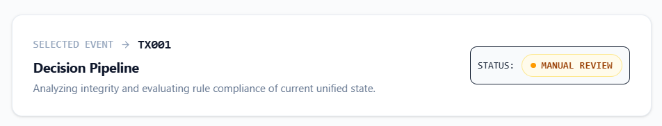
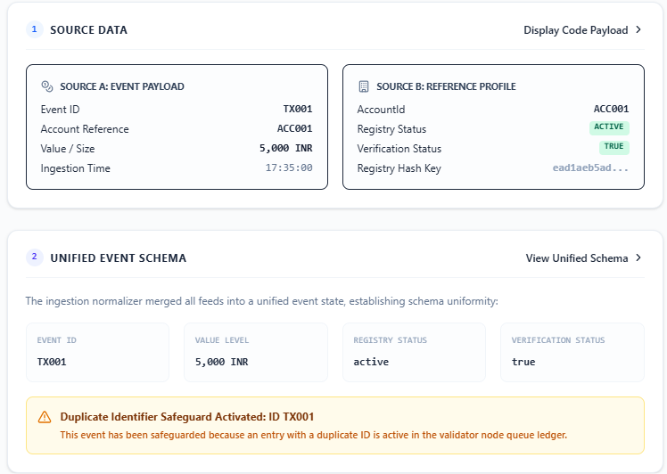
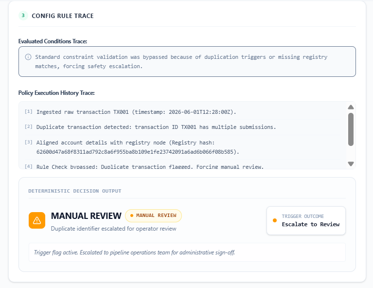

---

### 3. Reject — KYC Verification Failed (TX002)
ACC002 has `kycVerified: false` in the registry. The `requireKYC` rule fails, blocking the transaction.

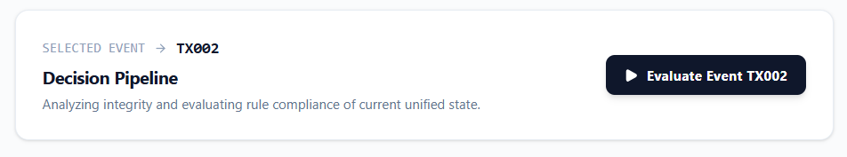
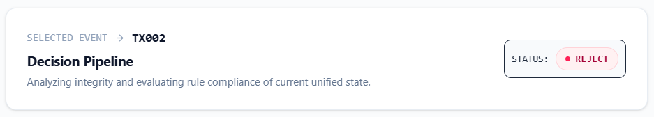
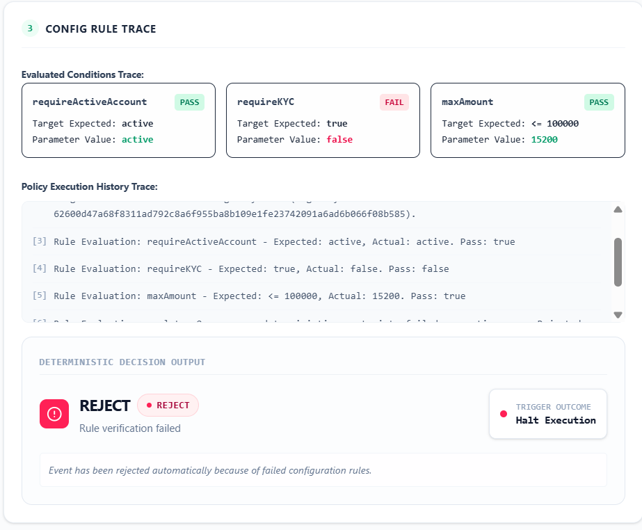

---

### 4. Reject — Amount Threshold Exceeded (TX004)
ACC004 is active and KYC-verified, but 150,000 exceeds the configured `maxAmount` of 100,000.

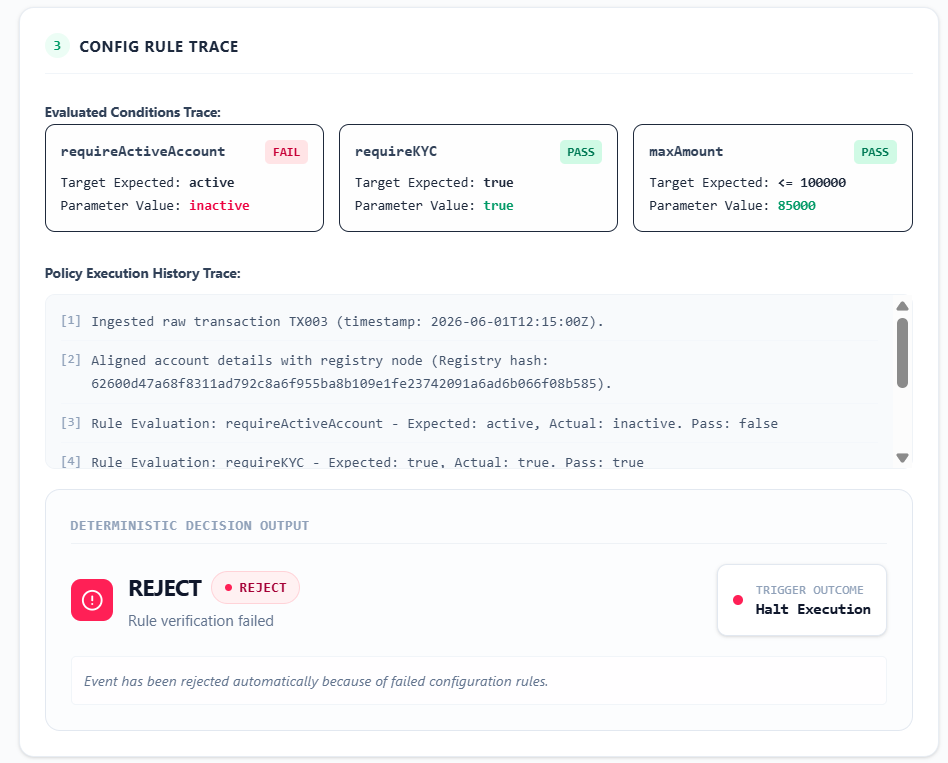
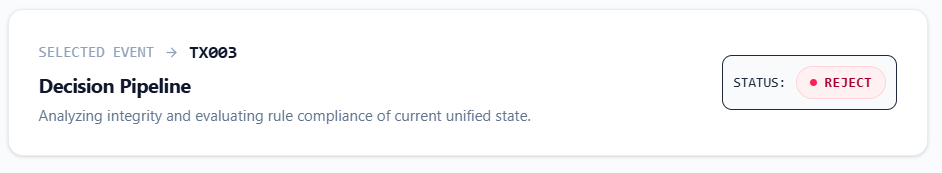

---

### 5. Approve — All Rules Passed (TX007)
Fresh transaction ingested via the Event Ingestion Hub. All three rules pass — account active, KYC verified, amount within limits.

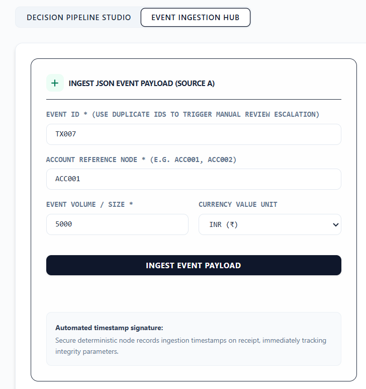
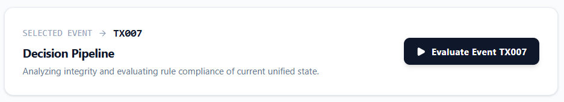
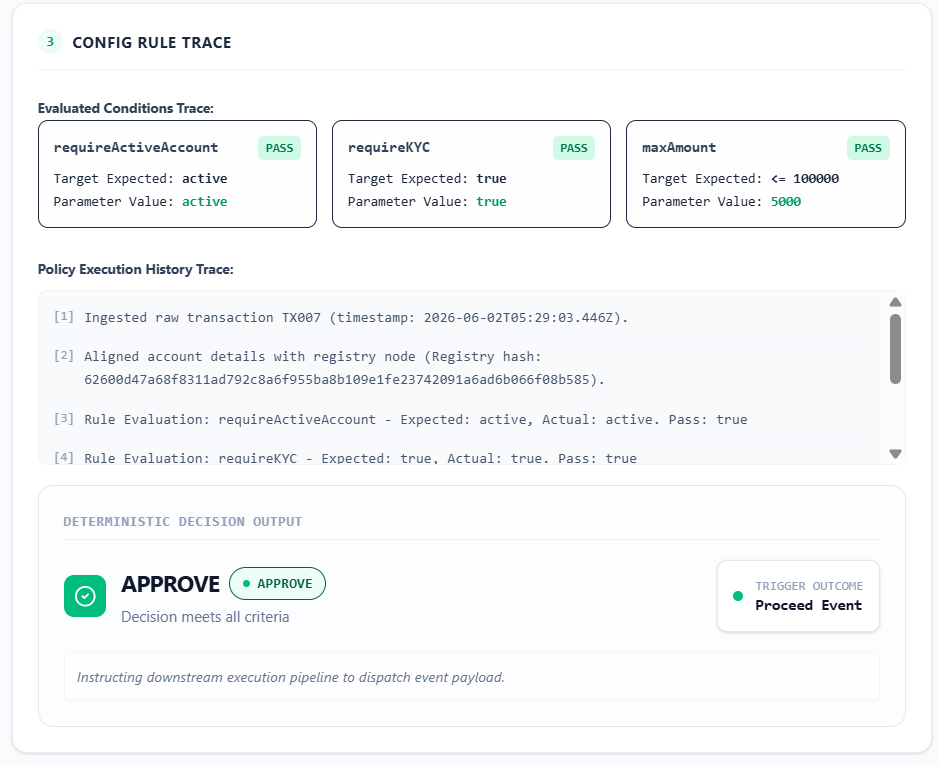

---

### 6. Certificate Viewer — SHA-256 Integrity Verified
Full JSON Decision Certificate with `certificateHash` visible. "Verify Integrity Certificate" recomputes the hash server-side and confirms it matches.

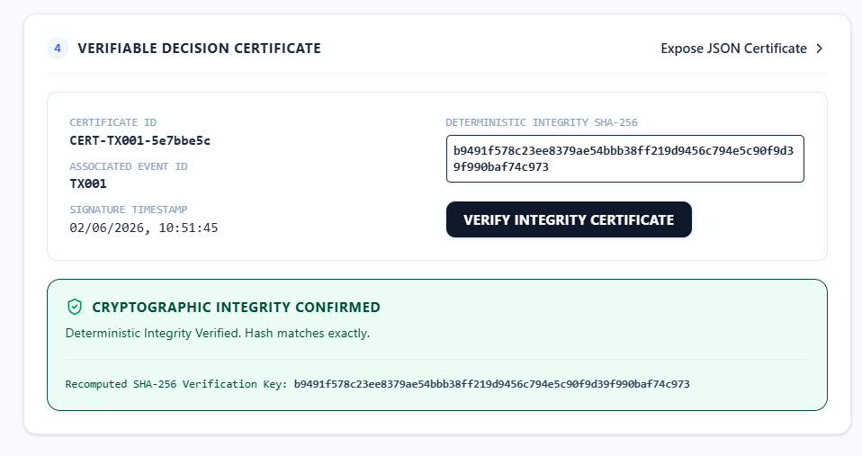

---

### 7. Insufficient Data — Missing Registry Record (TX005)
ACC099 has no entry in the account registry. The system returns `insufficient_data` and skips rule evaluation entirely.

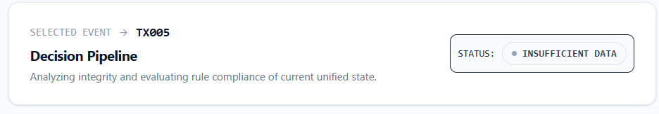
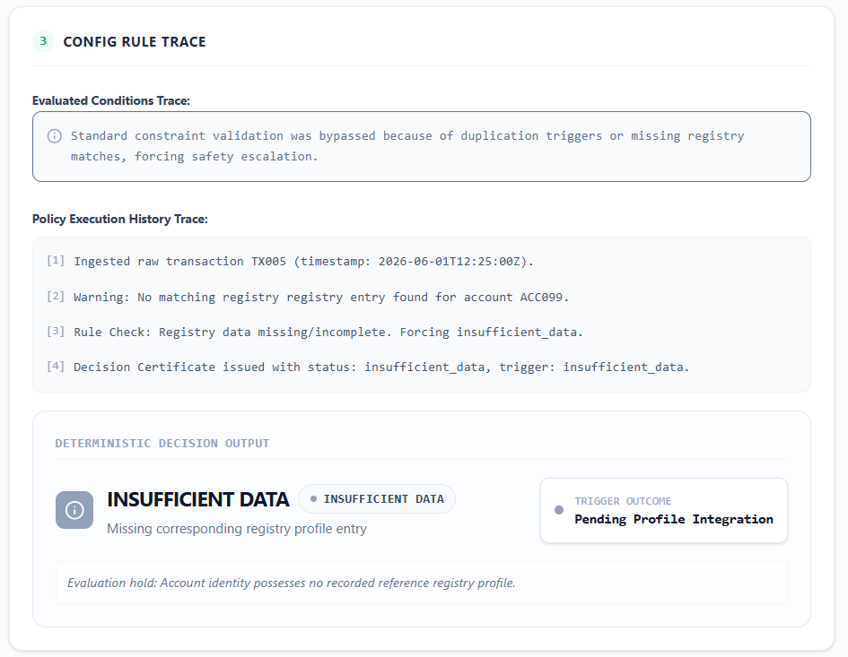

---

### 8. Event Ingestion Hub
Source A (JSON transaction) and Source B (CSV registry) ingestion forms, with the active registry payload and its SHA-256 hash visible.

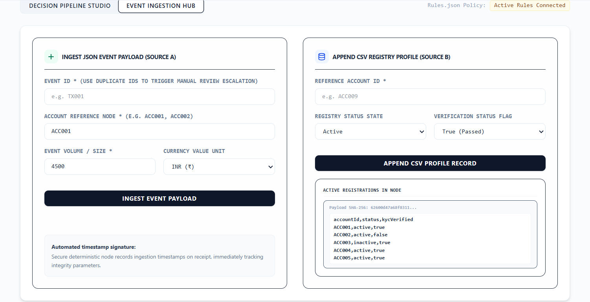
---

### 6. Certificate Viewer — SHA-256 Integrity Verified
The full JSON Decision Certificate with the `certificateHash` field visible. Clicking "Verify Integrity Certificate" recomputes the hash server-side and confirms it matches.


---

### 7. Insufficient Data — Missing Registry Record (TX005)
ACC099 has no entry in the account registry. The system returns `insufficient_data` and skips rule evaluation entirely.


---

### 8. Event Ingestion Hub
The ingestion forms for Source A (JSON transaction) and Source B (CSV registry row), with the active registry payload and its SHA-256 hash visible at the bottom.


---

## Engineering Trade-offs

**In-memory storage instead of a database.** All state lives in server-side arrays. This eliminates setup friction for a prototype and keeps the focus on the decision layer. The trade-off is that state is lost on server restart. A production version would use Postgres with indexed lookups on `transactionId`.

**Deterministic serialization via `deterministicStringify`.** Standard `JSON.stringify` does not guarantee key ordering across JS engines. A custom recursive key-sort function ensures the same certificate content always produces the same SHA-256 hash regardless of environment.

**`generateCertificate` captures `new Date()` at call time.** This means re-evaluating the same transaction twice produces different `timestamp` values, and therefore different `certificateHash` values. This is intentional — each evaluation is a distinct certification event. True idempotency would require a content-addressed timestamp (e.g. derived from input hashes), noted as a future improvement.

**Synchronous `rules.json` read.** `fs.readFileSync` is called on every `/api/evaluate` request. Acceptable for a prototype; production should cache with a file-watcher (`chokidar`) to reload on change.

**No authentication or role separation.** Any client can ingest events or retrieve certificates. A production system would partition ingestion (operators), evaluation (engine service), and certificate retrieval (auditors) behind separate credentials.

---

## Known Gaps & Future Work

- Replace in-memory arrays with SQLite (one file, no setup) for persistence across restarts
- Add `timestampOverride` parameter to `generateCertificate` to enable fully deterministic re-evaluation
- Duplicate detection currently scans the full array — needs O(1) lookup via a `Set` or DB index at scale
- HMAC/signature stub over the certificate hash for non-repudiation (the rubric lists this as a bonus)
- Rate limiting and input validation on the ingestion endpoint
